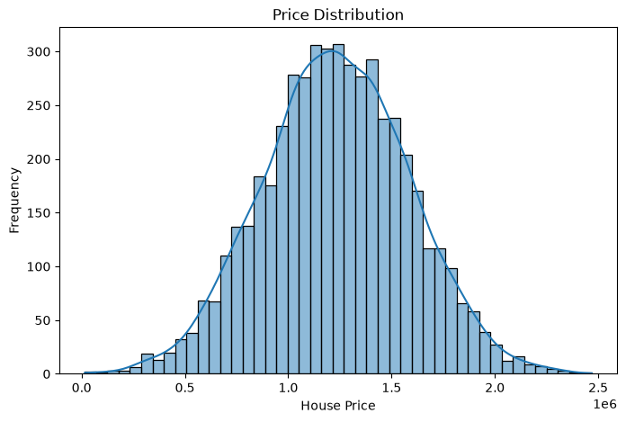
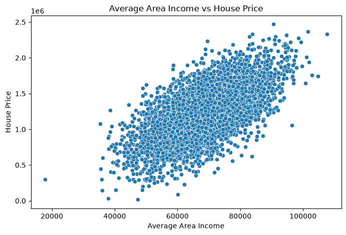
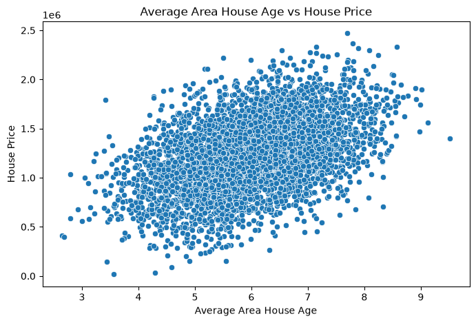
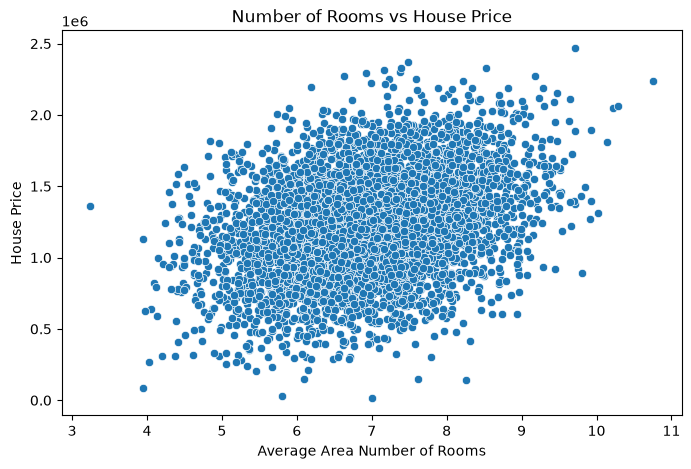
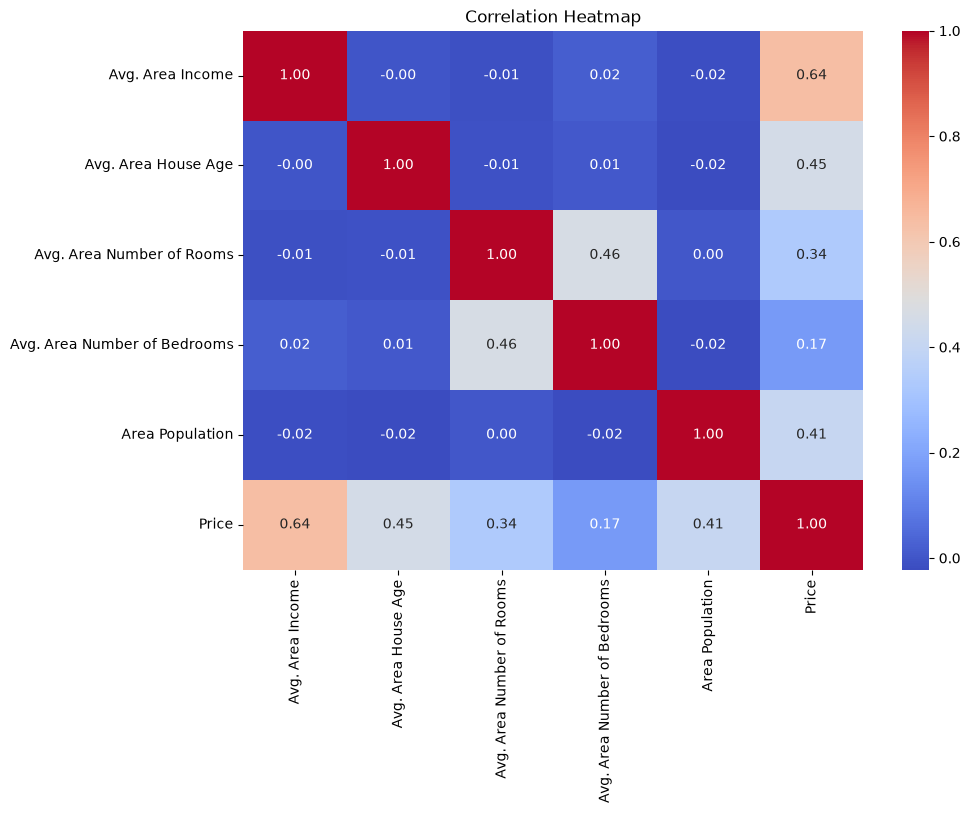
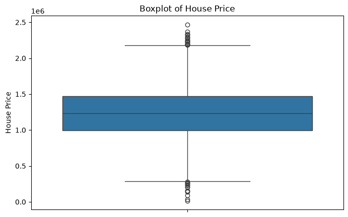

# 🏠 House Price Prediction

A Machine Learning-based web application that predicts house prices using **Linear Regression**. The project includes data preprocessing, exploratory data analysis (EDA), model training and evaluation, and an interactive **Streamlit** interface for making predictions.

## 🚀 Live Demo

**Streamlit App:**
https://house-price-predictior.streamlit.app/

## 📌 Project Overview

House prices depend on several factors such as area income, house age, number of rooms, number of bedrooms, and population. This project uses these features to build a machine learning model that predicts the estimated price of a house.

The trained model is integrated with a Streamlit web application, allowing users to enter house details and receive a predicted price.

## 🎯 Objectives

* Analyze the housing dataset.
* Perform data preprocessing and validation.
* Explore important patterns using EDA.
* Train a Linear Regression model for house-price prediction.
* Evaluate the model using appropriate regression metrics.
* Develop an interactive prediction interface using Streamlit.
* Deploy the application using Streamlit Community Cloud.

## 📊 Input Features

The model uses the following five features:

| Feature                      | Description                       |
| ---------------------------- | --------------------------------- |
| Avg. Area Income             | Average income of the area        |
| Avg. Area House Age          | Average age of houses in the area |
| Avg. Area Number of Rooms    | Average number of rooms           |
| Avg. Area Number of Bedrooms | Average number of bedrooms        |
| Area Population              | Population of the area            |

**Target Variable:** `Price`

## 🔄 Data Preprocessing

The dataset was prepared before model training through the following steps:

* Loaded the dataset using Pandas.
* Checked the dataset structure and data types.
* Checked for missing values.
* Selected the relevant input features and target variable.
* Split the dataset into training and testing sets.
* Used an 80:20 train-test split.

The selected model features are numerical, so categorical encoding was not required for the final prediction model.

## 📈 Exploratory Data Analysis (EDA)

EDA was performed to understand the distribution and relationships within the housing data.

The following visualizations were generated:

### 1. House Price Distribution

This visualization shows the distribution of house prices in the dataset.



### 2. Average Area Income vs House Price

This plot shows the relationship between average area income and house price.



### 3. House Age vs House Price

This visualization shows the relationship between the average age of houses and their prices.



### 4. Number of Rooms vs House Price

This plot shows the relationship between the average number of rooms and house price.



### 5. Correlation Heatmap

The correlation heatmap helps identify relationships between the numerical features and the target variable.



### 6. House Price Boxplot

The boxplot provides a visual representation of the distribution of house prices and helps identify possible outliers.



## 🤖 Machine Learning Model

### Linear Regression

**Linear Regression** was selected as the machine learning algorithm because the project focuses on predicting a continuous numerical target variable: house price.

The model learns the relationship between the selected housing features and the house price using the training data.

## 📊 Model Performance

The model was evaluated using the test dataset.

| Metric   |     Result |
| -------- | ---------: |
| R² Score |     0.9180 |
| MAE      |  80,879.10 |
| RMSE     | 100,444.06 |

The R² score of approximately **0.918** indicates that the model explains a substantial portion of the variation in house prices on the test dataset.

## 🛠️ Tools and Technologies

* **Python** – Programming language
* **Pandas** – Data loading and analysis
* **NumPy** – Numerical operations
* **Matplotlib** – Data visualization
* **Seaborn** – Statistical visualization
* **Scikit-learn** – Machine learning and model evaluation
* **Joblib** – Model saving and loading
* **Streamlit** – Web application development
* **VS Code** – Development environment
* **Git & GitHub** – Version control and source-code hosting
* **Streamlit Community Cloud** – Application deployment

## 📁 Project Structure

```text
HOUSE-PRICE-PREDICTION/
│
├── dataset/
│   └── housing.csv
│
├── images/
│   ├── correlation_heatmap.png
│   ├── house_age_vs_price.png
│   ├── income_vs_price.png
│   ├── price_boxplot.png
│   ├── price_distribution.png
│   └── rooms_vs_price.png
│
├── .gitignore
├── House_price_prediction_pkl
├── README.md
├── app.py
├── requirements.txt
└── train_model.py
```

## ⚙️ How to Run the Project Locally

### 1. Clone the repository

```bash
git clone https://github.com/Biswajitdas15/HOUSE-PRICE-PREDICTION.git
```

### 2. Open the project folder

```bash
cd HOUSE-PRICE-PREDICTION
```

### 3. Create a virtual environment

```bash
python -m venv .venv
```

### 4. Activate the virtual environment

For Windows:

```bash
.venv\Scripts\activate
```

### 5. Install the required packages

```bash
pip install -r requirements.txt
```

### 6. Run the Streamlit application

```bash
streamlit run app.py
```

The application will open in your browser.

## 🌐 Deployment

The application is deployed using **Streamlit Community Cloud**.

**Live Application:**
https://house-price-predictior.streamlit.app/

## 🔗 Project Repository

**GitHub:**
https://github.com/Biswajitdas15/HOUSE-PRICE-PREDICTION

## 🔮 Future Improvements

* Compare Linear Regression with other regression algorithms.
* Improve prediction accuracy through feature engineering.
* Add more advanced visualizations to the web application.
* Add model comparison and performance visualization.
* Provide additional information about prediction confidence.
* Improve the user interface and overall application design.

## 👨‍💻 Author

**Biswajit Das**

B.Tech Computer Science and Engineering

---

⭐ If you find this project useful, consider giving the repository a star!
